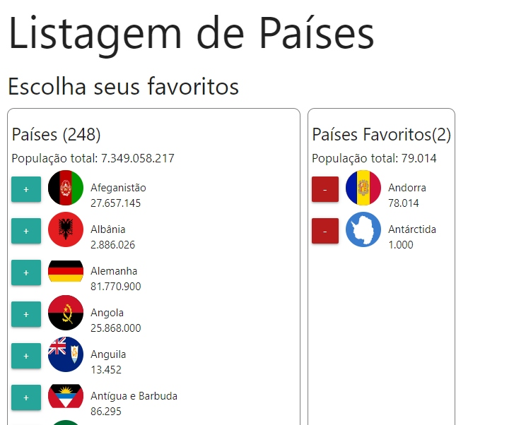

<h1 align="center">Listagem de Países</h1>
<h3>:computer: Sobre o projeto:</h3

Projeto criado durante o 1º módulo do bootcamp Fullstack da IGTI. Onde seu prósito era treinar funções do javascript, programação assíncrona, treinar a lógica de programação e trabalhar com API's

<h3>:wrench: Funcionalidades</h3>
<ul>
<li>Trazer dados de países de uma API e montar uma lista</li>
<li>Adicionar e Remover os países de uma lista secundária(Lista de Favoritos)</li>
<li>Somátoria da população dos países na lista secundária</li>
</ul>
<h3>:calendar: Status do Projeto</h3>

Completo

<h3>:art:Layout</h3>

<strong>Se você se interessou e gostaria de testar, <a href="https://mands-codes.github.io/listagem_de_paises-cursoIGTI/I/">clique aqui</a></strong>

<h3>☑️ Tecnologias</h3>

A ferramenta a seguir foi utilizada na construção do layout do projeto

<a href="https://materializecss.com/">Materialize</a> 
<a href="https://restcountries.eu/rest/v2/all">API com os dados dos países</a>
